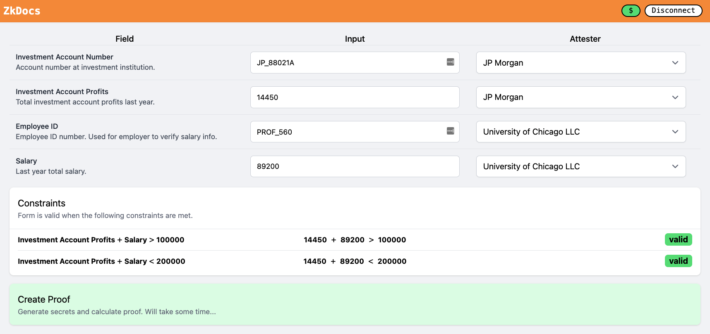
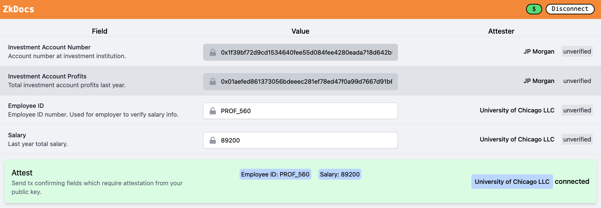
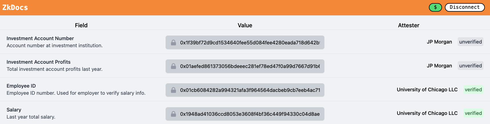
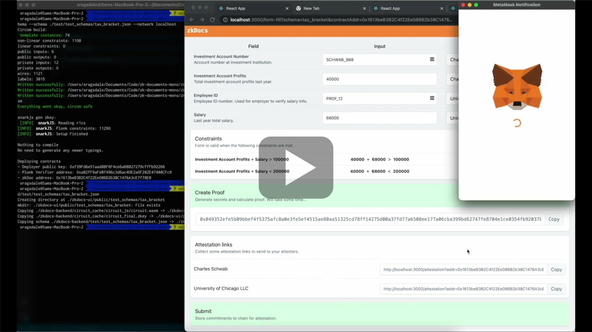

# zkDocs

Many organizations and institutions rely on carefully sharing private information and verifying its authenticity for applications from mortgage lending to college admissions. But in practice, these privacy-protecting workflows involve a series of subjective access confirmations as humans query other humans. They are often error-prone, inefficient, and leaky processes that expose unnecessary information, and may not be suitable for handling our most sensitive data.

zkDocs improve privacy throughout information attestation and verification workflows using cryptographic commitments and zero-knowledge proofs. The goal of this repo is to demo these technologies and make them trivial to use via schema to SNARK circuit transpilation.



## Repo structure
- `./zkdocs-backend` – the transpiler, circuits, contracts, and tests
- `./zkdocs-ui` – a sample react client which renders schemas and interacts with contracts
- `./zkdocs-lib` – code shared by the other workspaces

## How This Works
Three relevant actors interact with zkDocs throughout the process:
- **Verifier**: The admin or creator of a zk-doc schema (ex: creditor / mortgage lender)
- **Submitter**: An individual or individuals seeking to be verified by the schema (ex: mortgage seeker)
- **Attestor**: Someone that can attest to some of the submitters fields (ex: employer / home appraiser)

First, a verifier creates a schema. 

The schema is a json of the format:
```
{
    fields: [...field info...],
    constraints: [...aggregations over fields...],
    trusted_institutions: [...set of attestors...]
}
```

From the schema the library transpiles a zero-knowledge circuit. Now the verifier can deploy the zkDoc smart contract and associated PLONK verifier contract EVM-based chain.

Submitters can then connect a client (like `./zkdocs-ui`) and submit some *commitments* to the fields. These commitments are computed as `hash(value, nonce)` for each field in the schema. Commitments are a cryptographic scheme with two important properties:
- One way: probabalistically near impossible to reverse the value from the commitment to the value
- Collision resistant: probabilistically near impossible that a submitter can post a commitment and later find another `(value, nonce)` combination hashing to the same commitment

As a result, a submitter cannot change their inputs after broadcasting the commitment, but has also not revealed any information about their underlying values.

Once the submitter has posted their commitments, they can send the relevant `(value, nonce)` tuples to each of their attestors. The attestor can compute `hash(value, nonce)` locally and confirm that the commitment matches what was initially broadcast. Then the attestor can confirm that the value of the field is true based on whatever privileged information they have access to (like an employer verifying a individual's salary). No other participants have access to the value underlying the commitment, yet all participants can confirm each field has received an attestation. We do assume that the privileged actors do not leak the `(value, nonce)` to other parties. In this context, we use Ethereum native public key cryptography to ensure authenticity of attestor and to broadcast commitments. 

Finally the submitter can generate a zero-knowledge proof: `proof(values, nonces, commitments)`. The proof confirms that the values/nonces underlying the commitment have not changed and verifies that all fields satisfy schema constraints (such as the sum of the fields is below a threshold), without revealing any of the values to the verifier.

Combining on-chain attestations and the zero-knowledge proof, a verifier can be sure that the schema has been filled out truthfully without knowledge of the underlying fields. Of course, the submitter could also "decrypt" any of the commitments to any verifying party at any time by providing the corresponding `(value, nonce)`.

More specific details are available in `./zkdocs-backend/README.md`.

## zkDocs Client
The `zkdocs-ui` client is a sample react client which renders arbitrary schemas and demos workflows for the three actors mentioned above. 

Submitters can fill out schema fields and post commitments to chain. The UI will generate attestation links for each attestor, which include decryption keys for each field. Additionally submitters can generate their zk-proof that the underlying fields are valid.


Attestors can open these links (with a connected wallet) in the client. The client will verify that the schema stored locally matches the on-chain contract. It will then verify that each `(value, nonce)` hash they've been provided by the submitter matches the commitment on-chain. Finally, they can send a transaction attesting to each commitment.


Any third party verifier can view the state of the document submission process for any user without knowledge of any of the underlying fields.



## Demo
[](https://www.youtube.com/watch?v=50sclcEVYUY "zkDocs")


## Commands
- Clone: `gh repo clone a16z/zkdocs`
- Install: `yarn install`
- Check `./zkdocs-ui` + `./zkdocs-backend` for workspace specific commands.


## Local Demo
### Prereqs
- [Install Circom, SnarkJS](https://docs.circom.io/getting-started/installation/#installing-dependencies)

### Cmds
- `yarn install`
- `yarn start-local-backend`
- `yarn run-demo`
- `yarn start-local-client`
- Navigate to `localhost:3000`, switch wallet to Harhdat testnet (`localhost:8545`)
- Enter zkDoc contract address (should be `0xe7f1725e7734ce288f8367e1bb143e90bb3f0512`)

## Disclaimer
_These smart contracts are being provided as is. No guarantee, representation or warranty is being made, express or implied, as to the safety or correctness of the user interface or the smart contracts. They have not been audited and as such there can be no assurance they will work as intended, and users may experience delays, failures, errors, omissions or loss of transmitted information. In addition, any airdrop using these smart contracts should be conducted in accordance with applicable law. Nothing in this repo should be construed as investment advice or legal advice for any particular facts or circumstances and is not meant to replace competent counsel. It is strongly advised for you to contact a reputable attorney in your jurisdiction for any questions or concerns with respect thereto.  a16z is not liable for any use of the foregoing and users should proceed with caution and use at their own risk. See a16z.com/disclosure for more info._
